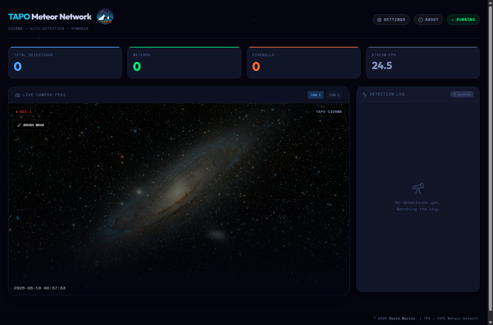
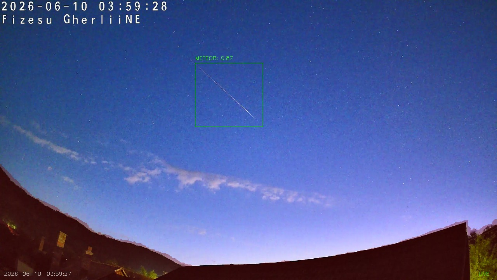

# TAPO Meteor Network

Local meteor and fireball detection dashboard for TAPO RTSP cameras.

TAPO Meteor Network combines a React/Vite dashboard with a Python/OpenCV backend to monitor live camera streams, detect meteor/fireball candidates, save evidence images, and let the operator mask unwanted areas of the sky with a brush editor.

Watch the demo/tutorial on YouTube: [TAPO Meteor Network tutorial](https://youtu.be/2TvySN--I4Q?si=gvFPOTc75veD6XF-)

[](https://youtu.be/2TvySN--I4Q?si=gvFPOTc75veD6XF-)



## Demo And Field Results

The project has been tested with real TAPO camera footage from sky-monitoring locations in Romania.



 

Useful links:

- [Video tutorial](https://youtu.be/2TvySN--I4Q?si=gvFPOTc75veD6XF-)
- [David Marica YouTube channel](https://www.youtube.com/@davidmarica)
- [Fireballs playlist](https://youtube.com/playlist?list=PLgQ-aF2p2PeWh98kYGRniHpJjJLnT7Kfu&si=zzp0oyPDXHshQd5u)

The screenshots show the dashboard, brush mask workflow, and real meteor detections captured from live camera feeds.

## Why This Project Exists

Meteor cameras often run in imperfect real-world conditions: rooftops, trees, buildings, light pollution, Moon glare, camera compression, and unstable RTSP streams. This project is built as a practical local tool for monitoring TAPO C325WB cameras and helping a small meteor-observer network review useful detections.

The app focuses on:

- Real-time multi-camera monitoring.
- Local-first operation with no cloud dependency.
- Meteor/fireball candidate detection using OpenCV image processing.
- Brush masks for excluding trees, rooftops, lamps, skyline glow, and other false-positive areas.
- A dashboard that non-technical operators can use during nightly observing.

## Features

- Live RTSP camera dashboard.
- Per-camera status, FPS, and detection counters.
- Meteor and fireball event log with saved images.
- Brush-based mask editor for excluding unwanted sky regions.
- Configurable detection thresholds.
- Multi-camera configuration from JSON.
- Local Flask backend serving both API and production dashboard.
- Windows executable and installer build flow with PyInstaller and Inno Setup.

## Tech Stack

Frontend:

- React
- TypeScript
- Vite
- Tailwind CSS
- lucide-react icons

Backend:

- Python
- Flask
- OpenCV
- NumPy
- MetDetPy model assets

Packaging:

- PyInstaller
- Inno Setup

## Architecture

```text
TAPO RTSP Cameras
        |
        v
Python Flask Backend
  - RTSP capture
  - frame processing
  - OpenCV detection
  - brush mask application
  - saved detection images
        |
        v
React Dashboard
  - live camera feed
  - detection log
  - camera status
  - settings
  - brush mask editor
```

## Local Development

Install frontend dependencies:

```bash
npm install
```

Build the dashboard:

```bash
npm run build
```

Configure cameras:

```bash
cp tpn-backend/config.example.json tpn-backend/config.local.json
```

Keep real RTSP credentials only in `tpn-backend/config.local.json`.

Install backend dependencies:

```bash
cd tpn-backend
pip install -r requirements.txt
```

Start the detector:

```bash
python app.py
```

The app opens at:

```text
http://localhost:5000
```

## Building the Windows App

From the repository root:

```bash
npm install
npm run build
```

Then build the backend executable:

```bash
cd tpn-backend
python build_exe.py
```

The executable folder is created at:

```text
tpn-backend/dist/TAPO_Meteor_Network
```

To create the installer, open `tpn-backend/installer.iss` in Inno Setup and compile it.

The installer output is created at:

```text
tpn-backend/InstallerOutput/TAPOMeteorNetwork_Setup.exe
```

## Security Notes

Do not commit real RTSP camera credentials.

Use:

```text
tpn-backend/config.local.json
```

for private camera URLs. That file is ignored by Git.

## Roadmap

- Better raw FPS vs processed FPS diagnostics.
- More screenshots and short demo clips.
- Improved city-sky detection presets.
- Pre/post event video clips.
- Camera health monitoring and stream reconnect metrics.
- Optional export format for shared meteor network reports.

## Author

Built by David Marica for TAPO-based local meteor monitoring and community sky-observation experiments.
